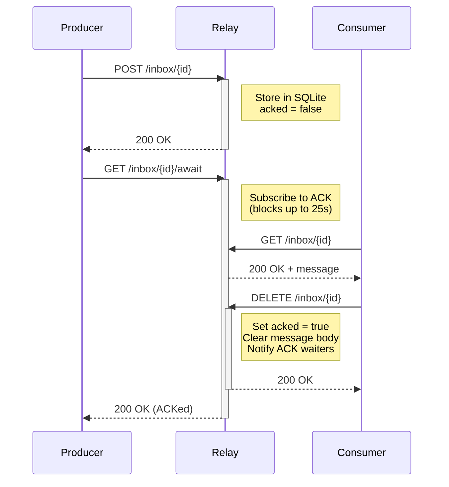

# http-relay

[](https://crates.io/crates/http-relay)
[](https://github.com/pubky/http-relay/actions/workflows/ci.yml)
[](https://docs.rs/http-relay)
[](LICENSE)

An HTTP relay for reliable asynchronous message passing between producers and consumers,
with store-and-forward semantics and explicit acknowledgment.

Built primarily for [Pubky](https://pubky.org) applications, but usable as a general-purpose relay.

**[Try the interactive demo](https://pubky.github.io/http-relay/)**

## What is this?

An HTTP relay enables decoupled communication between distributed services.
Producers POST messages to a channel; consumers GET them. The relay handles
the coordination, storage, and delivery confirmation.

**Use cases:**
- Mobile apps that need reliable message delivery despite OS backgrounding
- Services that can't communicate directly (NAT traversal, firewall bypass)
- Decoupled microservices with delivery confirmation requirements

## Features

- **Store-and-forward** - Messages persist until explicitly acknowledged
- **At-least-once delivery** - Consumers can retry; message stays available until ACKed
- **Delivery confirmation** - Producers can block until consumer ACKs, or check status
- **Mobile-friendly timeouts** - 25s default stays under typical proxy limits (nginx, Cloudflare)
- **Content-Type preservation** - Forwards producer's Content-Type to consumer
- **Legacy compatibility** - `/link/{id}` endpoint for existing integrations. [See old codebase](https://github.com/pubky/pubky-core/tree/4e988542c4297030358cab62c241be75480d9a06/http-relay)

## Installation

```bash
cargo install http-relay
```

Or add as a dependency:

```toml
[dependencies]
http-relay = "0.6"
```

## Usage

### As CLI

```bash
# Default: bind to 127.0.0.1:8080 (localhost only)
http-relay

# Bind to all interfaces (for production/Docker)
http-relay --bind 0.0.0.0

# Custom configuration
http-relay --bind 0.0.0.0 --port 15412 --inbox-cache-ttl 300 --inbox-timeout 25 -vv
```

**Options:**

| Flag | Description | Default |
|------|-------------|---------|
| `--bind <ADDR>` | Bind address | `127.0.0.1` |
| `--port <PORT>` | HTTP port (0 = random) | `8080` |
| `--inbox-cache-ttl <SECS>` | Message TTL for inbox | `300` |
| `--inbox-timeout <SECS>` | Inbox long-poll timeout | `25` |
| `--max-body-size <BYTES>` | Max request body size | `2048` (2KB) |
| `--max-entries <N>` | Max entries in waiting list | `10000` |
| `--persist-db <PATH>` | SQLite database path for persistence | (in-memory) |
| `-v` | Verbosity (repeat for more) | warn |
| `-q, --quiet` | Silence output | - |

### As Library

```rust
use http_relay::HttpRelayBuilder;

#[tokio::main]
async fn main() -> anyhow::Result<()> {
    let relay = HttpRelayBuilder::default()
        .http_port(15412)
        .run()
        .await?;

    println!("Running at {}", relay.local_link_url());

    tokio::signal::ctrl_c().await?;
    relay.shutdown().await
}
```

## API

### Inbox Endpoints

The primary API. Store-and-forward with explicit acknowledgment.

| Method | Endpoint | Description |
|--------|----------|-------------|
| `POST` | `/inbox/{id}` | Store message (returns 200 immediately) |
| `GET` | `/inbox/{id}` | Retrieve message (long-poll, waits up to 25s) |
| `DELETE` | `/inbox/{id}` | ACK - confirms delivery |
| `GET` | `/inbox/{id}/ack` | Returns `true` or `false` (was message ACKed?) |
| `GET` | `/inbox/{id}/await` | Block until ACKed (25s default timeout) |


**Inbox IDs act as shared secrets.** Anyone who knows an ID can read/write/ACK
that inbox. IDs should be cryptographically random (e.g., 128-bit UUIDs).
Predictable IDs allow attackers to intercept or acknowledge messages.
Messages persist in plaintext memory for the TTL duration. Do not relay
sensitive one-time credentials unless encryption is applied at the
application layer.

#### POST `/inbox/{id}` - Store Message

Producer stores a message. Returns immediately without waiting for a consumer.
New value overrides the old value if it already exists.

```bash
curl -X POST http://localhost:8080/inbox/my-channel \
  -H "Content-Type: application/json" \
  -d '{"hello": "world"}'
```

**Responses:**
- `200 OK` - Message stored successfully
- `503 Service Unavailable` - Server at capacity

#### GET `/inbox/{id}` - Retrieve Message (Long-Poll)

Consumer retrieves the stored message. If no message is available, waits up to
25 seconds (configurable) for one to arrive.

```bash
curl http://localhost:8080/inbox/my-channel
```

**Responses:**
- `200 OK` - Returns message with original Content-Type
- `408 Request Timeout` - No message arrived within timeout (25s default)

#### DELETE `/inbox/{id}` - Acknowledge Delivery

Consumer acknowledges successful receipt. Clears the message from storage.

```bash
curl -X DELETE http://localhost:8080/inbox/my-channel
```

**Responses:**
- `200 OK` - Message acknowledged and cleared

#### GET `/inbox/{id}/ack` - Check ACK Status

Producer checks if message was acknowledged.

```bash
curl http://localhost:8080/inbox/my-channel/ack
```

**Responses:**
- `200 OK` - Body contains `true` (ACKed) or `false` (pending)
- `404 Not Found` - No message exists (not posted yet, or expired)

#### GET `/inbox/{id}/await` - Wait for ACK

Producer blocks until consumer acknowledges the message.

```bash
curl http://localhost:8080/inbox/my-channel/await
```

**Responses:**
- `200 OK` - Consumer ACKed the message
- `408 Request Timeout` - No ACK received within timeout (default 25s)

### Typical Flow



**Step by step:**

1. **Producer** POSTs message to `/inbox/{id}` — returns 200 immediately
2. **Producer** calls GET `/inbox/{id}/await` — blocks waiting for ACK
3. **Consumer** GETs message from `/inbox/{id}` — receives payload (or waits up to 25s if not yet available)
4. **Consumer** DELETEs `/inbox/{id}` — acknowledges receipt
5. **Producer's** `/await` call returns 200 — delivery confirmed

The consumer can call GET before the producer posts—it will long-poll up to 25s for the message to arrive. No polling loop needed.

### Link Endpoint (Legacy)

Implements the standard [HTTP Relay spec](https://httprelay.io/). Maintained for
backwards compatibility but not recommended for new integrations.

| Method | Endpoint | Description |
|--------|----------|-------------|
| `POST` | `/link/{id}` | Send message, block until consumer retrieves (10 min timeout) |
| `GET` | `/link/{id}` | Retrieve message, block until producer sends (10 min timeout) |

**Why prefer `/inbox`:** The `/link` endpoint has no ACK mechanism—if the consumer
disconnects after receiving data, the producer still gets `200 OK`. The 10-minute
timeout also exceeds typical proxy limits.

## Client Implementation Patterns

### Producer: Store and Wait for ACK

```javascript
async function produceToRelay(channelId, data) {
  // Store the message (returns immediately)
  while (true) {
    try {
      const storeResponse = await fetch(`http://relay.example.com/inbox/${channelId}`, {
        method: 'POST',
        headers: { 'Content-Type': 'application/json' },
        body: JSON.stringify(data),
      });

      if (storeResponse.status === 200) break;
      throw new Error(`Failed to store: ${storeResponse.status}`);
    } catch (error) {
      // Network error - retry after brief delay
      await new Promise(resolve => setTimeout(resolve, 1000));
      continue;
    }
  }

  // Wait for consumer to ACK (blocks up to 25s per call)
  while (true) {
    try {
      const awaitResponse = await fetch(
        `http://relay.example.com/inbox/${channelId}/await`
      );

      if (awaitResponse.status === 200) {
        return; // Consumer ACKed - delivery confirmed
      }

      if (awaitResponse.status === 408) {
        continue; // Timeout - keep waiting
      }

      throw new Error(`Unexpected status: ${awaitResponse.status}`);
    } catch (error) {
      // Network error - retry after brief delay
      await new Promise(resolve => setTimeout(resolve, 1000));
      continue;
    }
  }
}
```

### Consumer: Retrieve and ACK

```javascript
async function consumeFromRelay(channelId) {
  // Long-poll until message is available (waits up to 25s per call)
  while (true) {
    try {
      const response = await fetch(`http://relay.example.com/inbox/${channelId}`);

      if (response.status === 200) {
        const data = await response.text();

        // ACK the message (critical - producer is waiting for this)
        // Retry ACK on network error - message won't be re-delivered after success
        while (true) {
          try {
            await fetch(`http://relay.example.com/inbox/${channelId}`, {
              method: 'DELETE',
            });
            break;
          } catch (error) {
            await new Promise(resolve => setTimeout(resolve, 1000));
            continue;
          }
        }

        return data;
      }

      if (response.status === 408) {
        continue; // Timeout - no message yet, retry
      }

      throw new Error(`Unexpected status: ${response.status}`);
    } catch (error) {
      // Network error (app backgrounded, connection dropped, etc.)
      // Wait briefly then retry - message is still safe on the relay
      await new Promise(resolve => setTimeout(resolve, 1000));
      continue;
    }
  }
}
```

### Key Points

- **Network errors are recoverable**: Because messages persist until ACKed,
  both producer and consumer can safely retry on connection drops.
- **Consumer must ACK**: Call DELETE after processing. Until then, the message
  remains available (at-least-once delivery).
- **Producer can verify delivery**: Use /await to block until ACK, or /ack to
  check status without blocking.
- **Message TTL**: Unacknowledged messages expire after 5 minutes (configurable).

## Limitations

### TCP Cannot Detect Sudden Disconnects

When a consumer's network disappears suddenly (Wi-Fi off, tunnel, app killed),
the relay cannot detect this immediately. TCP acknowledgments can take 30+
seconds to fail when packets vanish.

This is why `/inbox` uses explicit ACKs: the producer only knows delivery
succeeded when the consumer calls DELETE. If the consumer crashes before ACKing,
the message remains available for retry.

## Development

```bash
# Run tests
cargo test

# Run with debug logging
RUST_LOG=debug cargo run
```

## Releasing

See [RELEASING.md](RELEASING.md) for how to publish a new version.
